# PyRTT

## 环境

1. Anaconda:4.7.12
2. Python:3.7
3. PyQt5:5.13.2
4. PyLink:0.3.3
5. PyInstaller:3.5
6. Windows 10 1906

调用SEGGER_RTT 显示数据和图像。虽然有JLinkRTTViewer和J-Scop，但还是觉得不方便，无法对数据进行分类，因此用PyQt5和PyLink重新写了这个界面。

SEGGER_RTT 是主要的调试工具，比串口快，且不用接出多余的线。不过J-LinkV9带虚拟串口，因此我的板子一般都是引出SWD和串口，一共六根线。

RAiny Yangtzeu

## Installation

1. 安装QtChart

   ```python
   pip install PyQtChart
   ```

2. 安装PyLink

   ```python
   pip install pylink-square
   ```

   或者

   ```
   pip install pylink
   ```

   pip install 无法导入pylink，我选择源码安装

    Clone the project into a local repository, then navigate to that directory and run: 

   ```python
   python setup.py install
   ```

   [PyLink](https://pylink.readthedocs.io/en/latest/installation.html)

3. 安装PyInstaller

   ```python
   pip install PyInstaller
   ```

   [PyInstaller](https://pyinstaller.readthedocs.io/en/stable/)

## QtDesigner 添加 QtChart

添加 Widget，提升为 QChartView

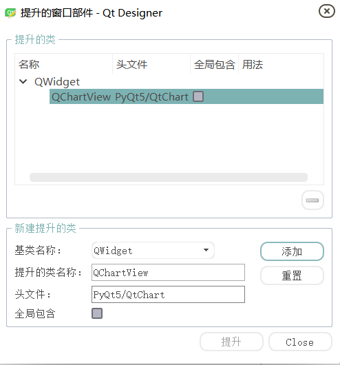

简单Demo代码：

```python
        chart = QChart()
        chart.setTitle("Line Chart 1")
        series = QLineSeries(chart)
        series.append(0, 6)
        series.append(2, 4)
        chart.addSeries(series)
        chart.createDefaultAxes()  # 创建默认轴

        # view = QChartView(chart)
        # view.setRenderHint(QPainter.Antialiasing)  # 抗锯齿
        self.widget.setChart(chart)
        self.widget.setRenderHint(QPainter.Antialiasing)    # 抗锯齿
```

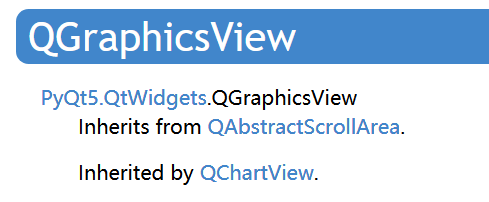

或者在垂直布局中加入QtChart

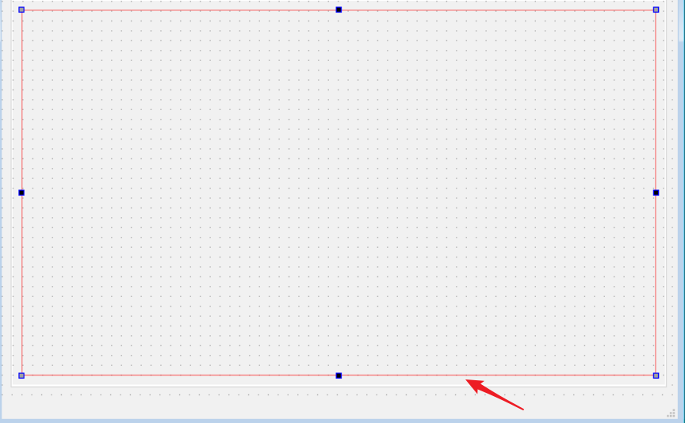

```python
        chart = QChart()
        chart.setTitle("Line Chart 1")
        series = QLineSeries(chart)
        series.append(0, 6)
        series.append(2, 4)
        chart.addSeries(series)
        chart.createDefaultAxes()  # 创建默认轴

        self.view = QChartView(chart)
        self.view.setRenderHint(QPainter.Antialiasing)  # 抗锯齿
        self.horizontalLayout.addWidget(self.view)
```

或者

```c++
QChartView *chartView = new QChartView(chart);//声明QChartView 并创建实例，加载chart

QGridLayout *baseLayout = new QGridLayout(); //便于显示，创建网格布局

baseLayout->addWidget(chartView, 1, 0);
ui->widChart->setLayout(baseLayout); //显示到QWidget控件 ui->widChart就是QWidget
```

```python
        chart_view = ChartView()
        baseLayout = QGridLayout()
        baseLayout.addWidget(chart_view)
        self.widget_plot.setLayout(baseLayout)
```

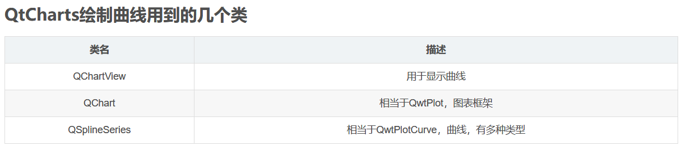

## QtChart

1.replace 和 append

```python
         # self.data_list = self.data_list.append(QPointF(self.axisX_data, self.axisY_data))
            # self.series.replace(self.data_list)
            # self.series.append(self.axisX_data, self.axisY_data)
```

replace 比 append 快，但只适合静态的，不适合动态的。

2.卡顿

开启OpenGL  self.series.setUseOpenGL(True) ，到6000个点击已经很卡顿了。


==解决方法：==

移除多余的点

```python
     if self.series.count() > 2000:
                self.series.removePoints(0, self.series.count() - 2000)
```

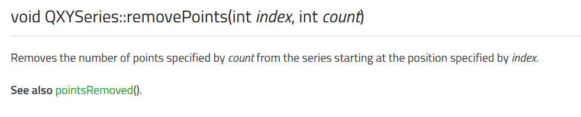

后期考虑更换为**[QCustomPlot-PyQt5](https://github.com/dimv36/QCustomPlot-PyQt5)**，但好像只有Linux可以支持 Linux operationg system 

但好像可以  pip install qcustomplot 

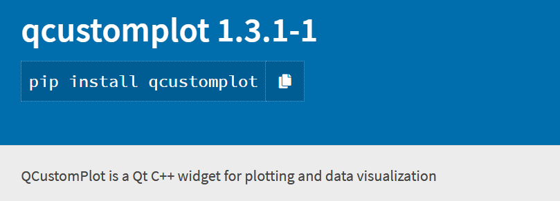

**install 错误**

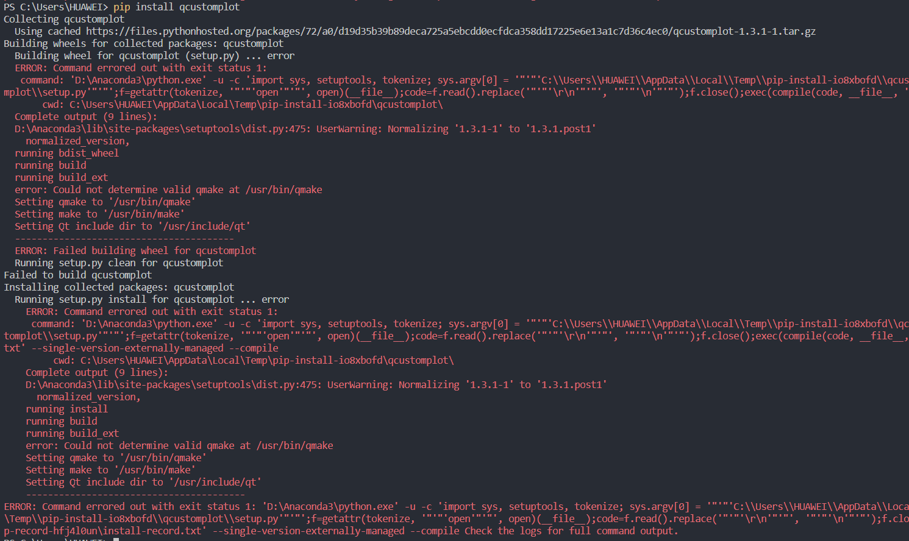

不能够Build。

又找到了，还说自己去造轮子勒，调用.cpp

[QCustomPlot2 2.0.1](https://pypi.org/project/QCustomPlot2/)


```
 pip install QCustomPlot2
```

pip install 还是失败

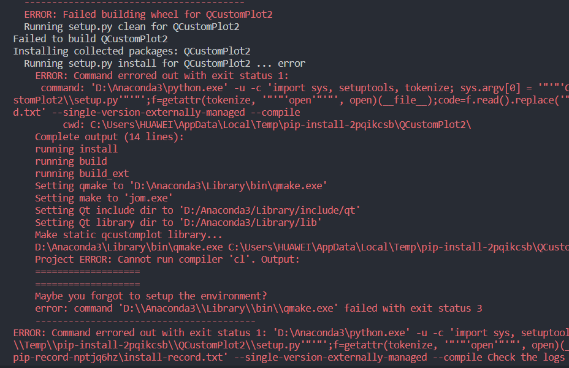

Windows

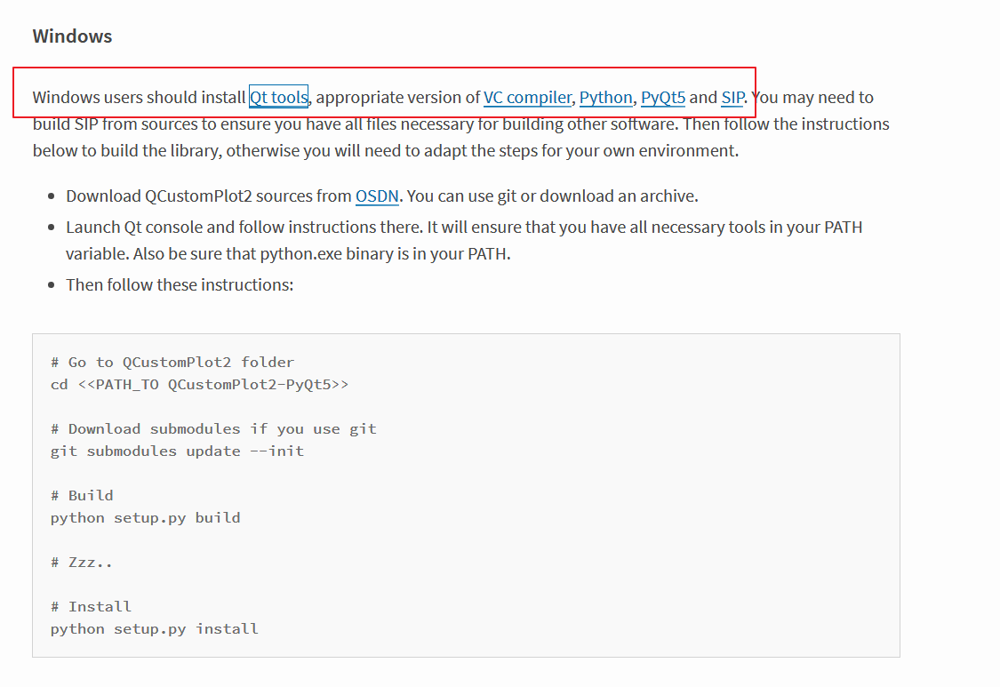

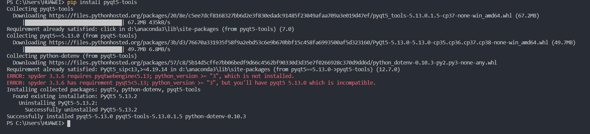

没有cl.exe

添加 cl.exe 路径

```
C:\Program Files (x86)\Microsoft Visual Studio\2019\Community\VC\Tools\MSVC\14.22.27905\bin\Hostx64\x86
```

没有jom.exe

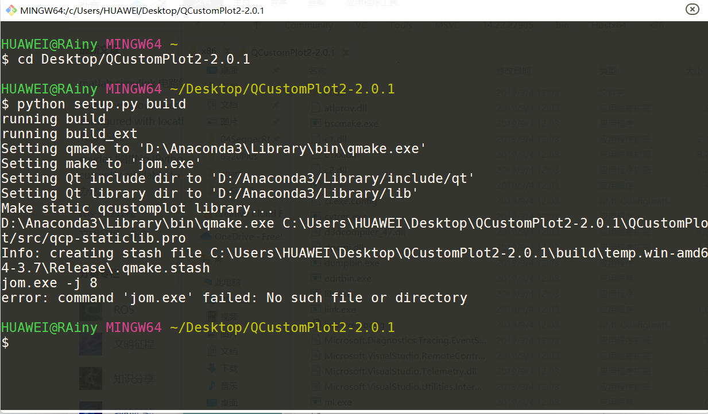

添加Qt的jom.exe路径，错误

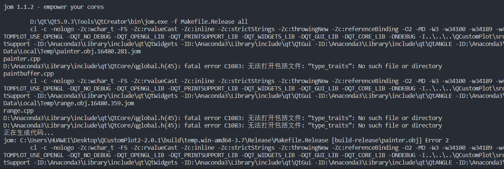

```
D:\Anaconda3\Library\include\qt\QtCore/qglobal.h(45): fatal error C1083: 无法打开包括文件: “type_traits”: No such file or directory
```

环境还是没有配置正确。。。还是直接用C++吧

[Pyside-QCP]( https://github.com/SBGit-2019/Pyside-QCP ),这个有windows下的编译，不过跟PySide2一起编译，感觉环境配置太麻烦了。还不如用C++。

## PyLink

1.PyLink rtt_read 无法读取SEGGER_RTT_Write的数据，只能读取SEGGER_RTT_printf的数据，不正常啊。

可以读取，配置为

```c
SEGGER_RTT_ConfigUpBuffer(0,NULL, NULL, 0, SEGGER_RTT_MODE_NO_BLOCK_SKIP);
```

数据内容：

const uint16_t g_SineWave128[] = {
2047, 2147, 2248, 2347, 2446, 2544, 2641, 2737, 2830, 2922, 3012, 3099, 3184, 3266, 3346, 3422,
3494, 3564, 3629, 3691, 3749, 3803, 3852, 3897, 3938, 3974, 4006, 4033, 4055, 4072, 4084, 4092,
4094, 4092, 4084, 4072, 4055, 4033, 4006, 3974, 3938, 3897, 3852, 3803, 3749, 3691, 3629, 3564,
3494, 3422, 3346, 3266, 3184, 3099, 3012, 2922, 2830, 2737, 2641, 2544, 2446, 2347, 2248, 2147,
2047, 1947, 1846, 1747, 1648, 1550, 1453, 1357, 1264, 1172, 1082,  995,  910,  828, 748,   672,
 600,  530,  465,  403,  345,  291,  242,  197,  156,  120,   88,   61,   39,   22,  10,     2,
   0,    2,   10,   22,   39,   61,   88,  120,  156,  197,  242,  291,  345,  403, 465,   530,
 600,  672,  748,  828,  910,  995, 1082, 1172, 1264, 1357, 1453, 1550, 1648, 1747, 1846, 1947,
};

读取：

<class 'list'>: [166, 13, 94, 13, 18, 13, 194, 12, 112, 12, 27, 12, 196, 11, 106, 11, 14, 11, 177, 10, 81, 10, 240, 9, 142, 9, 43, 9, 200, 8, 99, 8, 255, 7, 155, 7, 54, 7, 211, 6, 112, 6, 14, 6, 173, 5, 77, 5, 240, 4, 148, 4, 58, 4, 227, 3, 142, 3, 60, 3, 236, 2, 160, 2, 88, 2, 18, 2, 209, 1, 147, 1, 89, 1, 35, 1, 242, 0, 197, 0, 156, 0, 120, 0, 88, 0, 61, 0, 39, 0, 22, 0, 10, 0, 2, 0, 0, 0, 2, 0...

分析：

 SEGGER_RTT_Write(1, &g_SineWave128[(i++)%128], 2); //J-Scop 必须是通道1 后面size 是2 uint16_t 两个字节

==61, 		39,			22,			10,		2,		0,		2==

==61,	0,	39,	0,	22,	0,	10,	0,	2,	0,	0,	0,	2==

2.第一个读取的数据与第二个衔接不对，及第二个数据后才是正确且实时显示

[600.0, 672.0, 748.0, 828.0, 910.0, 995.0, 1082.0, 1172.0, 1264.0, 1357.0, 1453.0, 1550.0, 1648.0, 1747.0, 1846.0, 1947.0, 2047.0, 2147.0, 2248.0, 2347.0, 2446.0, 2544.0, 2641.0, 2737.0, 2830.0, 2922.0, 3012.0, 3099.0, 3184.0, 3266.0, 3346.0, 3422.0, 3494.0, 3564.0, 3629.0, 3691.0, 3749.0, 3803.0, 3852.0, 3897.0, 3938.0, 3974.0, 4006.0, 4033.0, 4055.0, 4072.0, 4084.0, 4092.0, 4094.0, 4092.0, 4084.0, 4072.0, 4055.0, 4033.0, 4006.0, 3974.0, 3938.0, 3897.0, 3852.0, 3803.0, 3749.0, 3691.0, 3629.0, 3564.0, 3494.0, 3422.0, 3346.0, 3266.0, 3184.0, 3099.0, 3012.0, 2922.0, 2830.0, 2737.0, 2641.0, 2544.0, 2446.0, 2347.0, 2248.0, 2147.0, 2047.0, 1947.0, 1846.0, 1747.0, 1648.0, 1550.0, 1453.0, 1357.0, 1264.0, 1172.0, 1082.0, 995.0, 910.0, 828.0, 748.0, 672.0, 600.0, 530.0, 465.0, 403.0, 345.0, 291.0, 242.0, ==197.0==]
X is 1 Y is 197.0
[600.0, 672.0, 748.0, 828.0, 910.0, 995.0, 1082.0, 1172.0, 1264.0, 1357.0, 1453.0, 1550.0, 1648.0, 1747.0, 1846.0, 1947.0, 2047.0, 2147.0, 2248.0, 2347.0, 2446.0, 2544.0, 2641.0, 2737.0, 2830.0, 2922.0, 3012.0, 3099.0, 3184.0, 3266.0, 3346.0, 3422.0, 3494.0, 3564.0, 3629.0, 3691.0, 3749.0, 3803.0, 3852.0, 3897.0, 3938.0, 3974.0, 4006.0, 4033.0, 4055.0, 4072.0, 4084.0, 4092.0, 4094.0, 4092.0, 4084.0, 4072.0, 4055.0, 4033.0, 4006.0, 3974.0, 3938.0, 3897.0, 3852.0, 3803.0, 3749.0, 3691.0, 3629.0, 3564.0, 3494.0, 3422.0, 3346.0, 3266.0, 3184.0, 3099.0, 3012.0, 2922.0, 2830.0, 2737.0, 2641.0, 2544.0, 2446.0, 2347.0, 2248.0, 2147.0, 2047.0, 1947.0, 1846.0, 1747.0, 1648.0, 1550.0, 1453.0, 1357.0, 1264.0, 1172.0, 1082.0, 995.0, 910.0, 828.0, 748.0, 672.0, 600.0, 530.0, 465.0, 403.0, 345.0, 291.0, 242.0, ==197.0==, ==3012.0==]
X is 2 Y is 3012.0

2.printf 格式

绘图：

```c
SEGGER_RTT_printf("CH1:%d",i++);
```

不显示绘图数据：

```c
SEGGER_RTT_printf("Log:Hello\r\n");
Log: xx \r\n           开头Log： 结尾 \r\n
```

## Log

==2019.11.23==

很多都不完善，陆陆续续写了快两个星期，从零基础开始。最近要忙一些其它的事情，先把坑挖起来。

==**待完善**==:

1.对输出不用信息进行分类输出

2.QChart还不完善，想达到的效果是 QTabWidget 的Plot 的例程的效果

==2019.11.27==

QTabWidget 的Plot 的例程修改了，但显示效果不理想，且暂时没有写多条曲线。

==2019.11.28==

放弃QTabWidget 的Plot 的例程修改了，很卡，且不跟随

加入对单独Log的显示，即单独不显示绘图数据（混合显示绘图数据一直刷屏，可以忽律其它打印信息）

写入绘图数据到csv文件待完成 

## 参考

[1.PyLink]( https://pylink.readthedocs.io/en/latest/index.html )

[2.QChart显示的点多了之后会卡顿的问题，解决方案]( https://blog.csdn.net/qq_31073871/article/details/86352020 )

[3.QtCharts小知识：如何把曲线显示到控件上](https://blog.csdn.net/ecourse/article/details/77636393)

[4.PyQt5/PyQt](https://github.com/PyQt5/PyQt)

[5.python正则表达式从字符串中提取数字](https://blog.csdn.net/u010412858/article/details/83062200)

[6.Python实用（正则表达式）](https://www.jianshu.com/p/5b7adc5403c5)